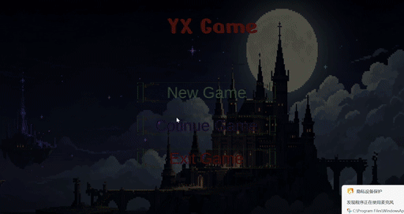

# 【类恶魔城游戏demo】

> 一句话简介——"基于 Unity 的 2D 动作闯关游戏 Demo，包含大致的战斗系统、装备系统与 Boss "。

## 实机演示



- 完整演示（60 秒，无声）：[`docs/demo.mp4`](docs/demo.mp4) —— 62 MB，原始画质 1992×1056
- 轻量版（60 秒，无声）：[`docs/demo_light.mp4`](docs/demo_light.mp4) —— 10 MB，1280×678

> 两个视频均已去除音轨。GIF 为前 12 秒预览，点开 mp4 可看完整流程。

## 开发环境

- Unity **2022.3.53f1c1**
- 目标平台：Windows


## 操作方式

| 操作      | 按键                 |
| ------- | ------------------ |
| 移动      | AD                 |
| 跳跃      | Space              |
| 冲刺      | LeftShift          |
| 普通攻击    | Mouse1             |
| 技能      | Z，Mouse2，X（某一装备技能） |
| 暂停      | Esc,Tab            |
| 背包技能树界面 | Tab                |

## 已实现内容

### 角色系统

- 状态机驱动的玩家控制（移动 / 跳跃 / 冲刺 / 攻击 / 受击 / 死亡）
- 冲刺附带无敌帧（`Entity.EvasionSet` / `EvasionOff`）
- 属性系统：力量、敏捷、智力、活力、暴击、闪避、魔力，支持 buff / debuff 与限时增益
- 击退与受击反馈（闪白、震屏）

### 战斗

- 近战攻击判定，带**弹反 / 反击窗口**（敌人攻击前摇会亮出提示）
- 多技能系统：黑涡、飞剑、水晶、雷击、冰火、影分身

### 敌人 AI

- 统一的敌人状态机 `EnemyStateMachine`，所有敌人共用一套状态基类
- 三种杂兵：骷髅近战、骷髅弓箭手、骷髅召唤师
- **Boss（两阶段）**
  - 一阶段：定点悬浮，操控天降激光攻击
  - 二阶段（血量低于 50% 触发）：可移动近身，三种手段——
    高速冲刺（对路径造成伤害）、隐身瞬移到玩家身后突袭、飞空悬停放激光后下坠砸地

### 其他系统

- 装备与物品栏（点击换装，LeftShift加点击丢弃，药剂点击使用，鼠标悬停查看介绍，属性实时结算）
- 掉落物与拾取
- 视差滚动背景
- Boss 血条 UI

## 目录结构

```
Assets/Scripts/
  Entity.cs              实体基类（翻转、击退、无敌帧、受击反馈）
  Stats/                 角色属性与伤害结算（暴击 / 闪避 / buff）
  Player/                玩家状态机与各状态
  Enemy/                 敌人基类与状态机
    Boss/                Boss 两阶段 AI（含空中激光、隐身突袭）
    Skeleton*/           三种杂兵
  Skill/                 技能与技能控制器
  Items and inventory/   物品与装备栏
  UI/                    血条、物品栏、菜单
  DataSaveManger/        存档读写与加密
```

## 如何运行

1. 用 Unity Hub 以 **2022.3.53f1c1** 打开本仓库根目录（Add project from disk）
2. 首次导入 Packages 需要几分钟，属正常现象
3. 打开 `Assets/Scenes/MainMenu.unity`，运行后进入主场景开始游戏

## 素材与参考说明

- 美术素材来源：免费素材以及AI生成
- 部分代码参考：https://www.udemy.com/course/2d-rpg-alexdev/


